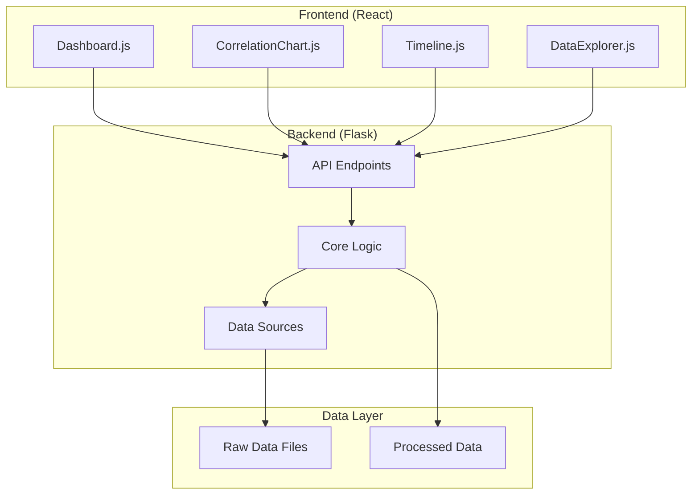

¡Excelente! Como arquitecto de sistemas, entiendo que una documentación clara y completa es tan crucial como el código mismo. Aquí tienes toda la documentación necesaria para que el proyecto FTRT-Cambrian Correlation sea comprensible, utilizable y extensible.

---

## 📚 Documentación del Proyecto

Esta documentación está diseñada para desarrolladores, científicos de datos y cualquier persona interesada en explorar la conexión entre el cosmos y la evolución.

### Tabla de Contenidos
1.  [Guía de Instalación y Configuración](#guía-de-instalación-y-configuración)
2.  [Documentación de la API](#documentación-de-la-api)
3.  [Guía del Usuario de la Interfaz Web](#guía-del-usuario-de-la-interfaz-web)
4.  [Guía para Colaboradores](#guía-para-colaboradores)
5.  [Arquitectura del Sistema](#arquitectura-del-sistema)
6.  [Glosario y Diccionario de Datos](#glosario-y-diccionario-de-datos)
7.  [Guía de Despliegue (Producción)](#guía-de-despliegue-producción)

---

<a name="guía-de-instalación-y-configuración"></a>
## 1. Guía de Instalación y Configuración

Esta guía te ayudará a poner en marcha el proyecto FTRT-Cambrian Correlation en tu máquina local para desarrollo o pruebas.

### Prerrequisitos

-   **Python 3.9+**
-   **Node.js 16+** y **npm**
-   **Docker** y **Docker Compose** (Opcional, pero recomendado)
-   **Git**

### Opción A: Usando Docker (Recomendado)

Esta es la forma más rápida y sencilla de ejecutar todo el ecosistema.

1.  **Clonar el Repositorio**
    ```bash
    git clone https://github.com/mechmind-dwv/ftrt-cambrian-correlation.git
    cd ftrt-cambrian-correlation
    ```

2.  **Construir y Levantar los Contenedores**
    ```bash
    docker-compose up --build
    ```
    Este comando construirá las imágenes para el backend y el frontend, y las iniciará. El backend estará disponible en `http://localhost:5000` y el frontend en `http://localhost:3000`.

3.  **(Opcional) Ejecutar en Segundo Plano**
    Para ejecutar los contenedores en modo detached (segundo plano):
    ```bash
    docker-compose up --build -d
    ```
    Para detenerlos:
    ```bash
    docker-compose down
    ```

### Opción B: Instalación Manual

Si prefieres ejecutar el proyecto directamente en tu máquina.

#### Backend (Python/Flask)

1.  **Crear y Activar un Entorno Virtual**
    ```bash
    python -m venv venv
    source venv/bin/activate  # En Windows: venv\Scripts\activate
    ```

2.  **Instalar Dependencias**
    ```bash
    cd backend
    pip install -r requirements.txt
    ```

3.  **Configurar Variables de Entorno**
    Crea un archivo `.env` en el directorio `backend/`:
    ```env
    FLASK_APP=run.py
    FLASK_ENV=development
    FLASK_DEBUG=True
    ```
    Para producción, establece `FLASK_ENV=production` y `FLASK_DEBUG=False`.

4.  **Iniciar el Servidor de Desarrollo**
    ```bash
    python run.py
    ```
    El servidor de la API estará corriendo en `http://localhost:5000`.

#### Frontend (React)

1.  **Instalar Dependencias**
    ```bash
    cd frontend
    npm install
    ```

2.  **Configurar el Proxy de la API**
    Asegúrate de que el archivo `frontend/package.json` contenga la línea:
    ```json
    "proxy": "http://localhost:5000"
    ```
    Esto permite que el frontend se comunique con el backend durante el desarrollo.

3.  **Iniciar el Servidor de Desarrollo**
    ```bash
    npm start
    ```
    La aplicación web se abrirá automáticamente en tu navegador en `http://localhost:3000`.

---

<a name="documentación-de-la-api"></a>
## 2. Documentación de la API

La API RESTful proporciona acceso programático a todos los datos y análisis del proyecto. La URL base es `http://localhost:5000/api`.

### Formato de Respuesta

Todas las respuestas JSON siguen una estructura consistente:

-   **Éxito**: `{"success": true, "data": {...}, "message": "..."}`
-   **Error**: `{"success": false, "error": "...", "message": "..."}`

### Endpoints

#### 1. Correlaciones

##### `GET /api/correlations`
Realiza un análisis de correlación completo entre eventos cósmicos y evolutivos en un rango de fechas.

**Parámetros de Consulta (Query Parameters):**
-   `start_date` (string, opcional): Fecha de inicio en formato `YYYY-MM-DD`. Por defecto: `2000-01-01`.
-   `end_date` (string, opcional): Fecha de fin en formato `YYYY-MM-DD`. Por defecto: fecha actual.
-   `max_lag_days` (integer, opcional): Máximo desfase temporal en días a considerar. Por defecto: `365`.

**Ejemplo de Solicitud:**
`GET /api/correlations?start_date=2020-01-01&end_date=2020-12-31&max_lag_days=180`

**Respuesta de Éxito (200 OK):**
```json
{
  "success": true,
  "data": {
    "cosmic_events": [
      {
        "timestamp": "2020-05-15T12:00:00",
        "type": "planetary_alignment",
        "magnitude": 2.1,
        "duration_days": 5,
        "description": "Significant FTRT peak detected."
      }
    ],
    "evolutionary_events": [
      {
        "timestamp": "2020-06-10T00:00:00",
        "type": "speciation",
        "magnitude": 4.5,
        "affected_taxa": ["Genus_A", "Genus_B"],
        "description": "Speciation event affecting 2 taxa."
      }
    ],
    "correlation_results": [
      {
        "correlation_coefficient": 0.65,
        "p_value": 0.02,
        "time_lag_days": 30,
        "confidence_interval": [0.55, 0.75],
        "significant": true
      }
    ],
    "best_correlation": {
      "correlation_coefficient": 0.65,
      "p_value": 0.02,
      "time_lag_days": 30,
      "significant": true
    }
  },
  "message": "Correlation analysis completed for period 2020-01-01 00:00:00 to 2020-12-31 00:00:00"
}
```

---

#### 2. Eventos Cósmicos

##### `GET /api/cosmic-events`
Recupera una lista de eventos cósmicos (picos FTRT, debilitamientos geomagnéticos).

**Parámetros de Consulta:**
-   `start_date` (string, opcional): Fecha de inicio `YYYY-MM-DD`.
-   `end_date` (string, opcional): Fecha de fin `YYYY-MM-DD`.
-   `type` (string, opcional): Tipo de evento (`ftrt`, `geomagnetic`, `all`). Por defecto: `all`.

**Ejemplo de Solicitud:**
`GET /api/cosmic-events?type=ftrt&start_date=2020-01-01`

**Respuesta de Éxito (200 OK):**
```json
{
  "success": true,
  "data": [
    {
      "timestamp": "2020-05-15T12:00:00",
      "type": "planetary_alignment",
      "magnitude": 2.1,
      "duration_days": 5,
      "description": "Significant FTRT peak detected."
    }
  ],
  "count": 1,
  "message": "Retrieved 1 cosmic events"
}
```

---

#### 3. Eventos Evolutivos

##### `GET /api/evolutionary-events`
Recupera una lista de eventos evolutivos (especiación, extinción).

**Parámetros de Consulta:**
-   `start_date` (string, opcional): Fecha de inicio `YYYY-MM-DD`.
-   `end_date` (string, opcional): Fecha de fin `YYYY-MM-DD`.
-   `type` (string, opcional): Tipo de evento (`speciation`, `extinction`, `all`). Por defecto: `all`.

**Ejemplo de Solicitud:**
`GET /api/evolutionary-events?type=speciation`

**Respuesta de Éxito (200 OK):**
```json
{
  "success": true,
  "data": [
    {
      "timestamp": "2020-06-10T00:00:00",
      "type": "speciation",
      "magnitude": 4.5,
      "affected_taxa": ["Genus_A"],
      "description": "Speciation event affecting 1 taxa."
    }
  ],
  "count": 1,
  "message": "Retrieved 1 evolutionary events"
}
```

---

<a name="guía-del-usuario-de-la-interfaz-web"></a>
## 3. Guía del Usuario de la Interfaz Web

La interfaz web en `http://localhost:3000` es tu portal para visualizar y explorar las correlaciones cósmico-evolutivas.

### Panel Principal (Dashboard)

Al cargar la aplicación, verás el panel principal que se divide en varias secciones:

1.  **Parámetros de Análisis**:
    -   **Fecha de Inicio/Fin**: Define el rango temporal para tu análisis.
    -   **Botón "Refresh Analysis"**: Vuelve a ejecutar el análisis con los parámetros seleccionados.

2.  **Hallazgos Clave (Key Findings)**:
    -   Muestra la mejor correlación encontrada en el rango de fechas, incluyendo el coeficiente de correlación, el valor p y el desfase temporal.
    -   Un mensaje indica si la correlación es estadísticamente significativa.

3.  **Pestañas de Visualización**:
    -   **Correlations**: Un gráfico de líneas que muestra el coeficiente de correlación en diferentes desfases temporales. Los puntos rojos indican correlaciones significativas.
    -   **Timeline**: Una línea de tiempo interactiva donde los eventos cósmicos (rojos) y evolutivos (turquesa) se muestran en secuencia. Haz clic en los puntos para ver más detalles.
    -   **Data Explorer**: Una tabla filtrable y ordenable para examinar todos los eventos cósmicos y evolutivos en detalle.

### Cómo Realizar un Análisis

1.  **Define tu Rango de Tiempo**: Usa los selectores de fecha para enfocarte en un período de interés (por ejemplo, el último año, una década específica, etc.).
2.  **Ejecuta el Análisis**: Haz clic en "Refresh Analysis". La aplicación consultará la API, procesará los datos y actualizará todas las visualizaciones.
3.  **Interpreta los Resultados**:
    -   En **Correlations**, busca picos que crucen el umbral de significancia. Un pico alto en `lag=60` días, por ejemplo, sugeriría que los eventos cósmicos tienden a preceder a los evolutivos en unos dos meses.
    -   En **Timeline**, busca agrupaciones de eventos de diferentes tipos cerca en el tiempo.
    -   En **Data Explorer**, usa los filtros para investigar eventos específicos, como todos los picos FTRT de alta magnitud.

---

<a name="guía-para-colaboradores"></a>
## 4. Guía para Colaboradores

¡Queremos tu ayuda para descifrar los misterios del cosmos! Aquí te explicamos cómo puedes contribuir al proyecto.

### Flujo de Trabajo

1.  **Haz un Fork del Repositorio**: Crea tu propia copia del proyecto en GitHub.
2.  **Clona tu Fork**: `git clone https://github.com/TU_USUARIO/-ftrt-cambrian-correlation.git`
3.  **Crea una Rama para tu Característica**: `git checkout -b feature/nueva-caracteristica-o-correccion`
4.  **Realiza tus Cambios**: Añade código, documenta, prueba.
5.  **Haz Commit de tus Cambios**: `git commit -m "Añadir: nueva funcionalidad de análisis X"`
6.  **Sube tu Rama**: `git push origin feature/nueva-caracteristica-o-correccion`
7.  **Abre un Pull Request (PR)**: Desde GitHub, abre un PR hacia la rama `main` de este repositorio. Describe claramente tus cambios.

### Estilo de Código

-   **Python**: Sigue las [PEP 8](https://pep8.org/). Usa linters como `flake8` o `black`.
-   **JavaScript**: Usa un linter como `ESLint` y un formateador como `Prettier`. Las configuraciones ya están incluidas en el proyecto.
-   **Mensajes de Commit**: Usa un formato claro y conciso (ej. `Fix:`, `Add:`, `Update:`, `Docs:`).

### Áreas de Contribución

-   **Mejora de Modelos**: ¿Puedes refinar los modelos estadísticos o de cálculo de FTRT?
-   **Nuevas Fuentes de Datos**: ¿Conoces otras bases de datos paleomagnéticas o de fósiles?
-   **Visualizaciones**: ¿Podemos añadir nuevos tipos de gráficos (mapas, diagramas de red)?
-   **Documentación**: Ayúdanos a mejorar esta documentación.
-   **Pruebas**: Añade tests unitarios o de integración para mejorar la robustez del sistema.

---

<a name="arquitectura-del-sistema"></a>
## 5. Arquitectura del Sistema

El proyecto sigue una arquitectura de microservicios (aunque implementada de forma monolítica por simplicidad) con un frontend y un backend claramente separados.



### Componentes Clave

-   **Frontend (React)**: Una aplicación de una sola página (SPA) que consume la API REST. Es responsiva y utiliza D3.js para visualizaciones complejas.
-   **Backend (Flask)**: Un servidor API que orquesta la lógica de negocio. Es agnóstico al frontend, lo que permite que otros clientes (ej. scripts de Python, herramientas de R) lo utilicen.
-   **Motores de Análisis (`backend/app/core/`)**:
    -   `CosmicEvolutionCorrelator`: El cerebro de la operación, que une todas las piezas.
    -   `PlanetaryTidalForceEngine`: Calcula las fuerzas de marea planetarias.
    -   `StatisticalAnalyzer`: Realiza las correlaciones, clustering y otros análisis.
-   **Fuentes de Datos (`backend/app/core/data_sources.py`)**: Abstrae el acceso a APIs externas (JPL, GEOMAGIA50, etc.), permitiendo cambiar de fuente de datos fácilmente.
-   **Scripts de Automatización (`scripts/`)**: Permiten la recolección y procesamiento de datos a gran escala fuera de la aplicación web, ideal para trabajos batch.

---

<a name="glosario-y-diccionario-de-datos"></a>
## 6. Glosario y Diccionario de Datos

### Glosario de Términos

-   **FTRT (Fuerza de Marea Relativa Total)**: Una métrica que cuantifica la fuerza de marea gravitacional combinada de los planetas sobre el Sol, que teóricamente modula la actividad solar.
-   **Pico FTRT**: Un momento en el que la FTRT supera un umbral determinado, indicando una alineación planetaria significativa.
-   **Debilitamiento Geomagnético**: Un período en el que la intensidad del campo magnético de la Tierra es inusualmente baja, permitiendo que más radiación cósmica alcance la superficie.
-   **Evento Evolutivo**: Un punto en el tiempo con una alta tasa de especiación o extinción, a menudo identificado a través del registro fósil.
-   **Desfase Temporal (Time Lag)**: El tiempo en días entre un evento cósmico y su correlación más fuerte con un evento evolutivo posterior.

### Diccionario de Datos

#### Modelo de Evento Cósmico (`CosmicEvent`)
-   `timestamp` (datetime): Fecha y hora del evento.
-   `event_type` (string): Tipo de evento (ej. `planetary_alignment`, `geomagnetic_weakness`).
-   `magnitude` (float): La magnitud o intensidad del evento (ej. valor FTRT, intensidad del campo magnético en nT).
-   `duration_days` (int): Duración estimada del evento en días.
-   `description` (string): Una descripción legible por humanos del evento.

#### Modelo de Evento Evolutivo (`EvolutionaryEvent`)
-   `timestamp` (datetime): Fecha estimada del evento (puede tener una gran incertidumbre).
-   `event_type` (string): Tipo de evento (`speciation`, `extinction`).
-   `magnitude` (float): Una medida del impacto del evento (ej. número de taxones afectados).
-   `affected_taxa` (array de strings): Lista de los taxones (géneros, familias) afectados.
-   `description` (string): Descripción del evento.

---

<a name="guía-de-despliegue-producción"></a>
## 7. Guía de Despliegue (Producción)

Esta guía cubre cómo desplegar la aplicación en un entorno de producción real.

### Prerrequisitos

-   Un servidor Linux (ej. Ubuntu 20.04+)
-   Docker y Docker Compose instalados
-   Un nombre de dominio (opcional, pero recomendado)
-   Nginx (opcional, como proxy inverso)

### Pasos de Despliegue

1.  **Configurar Variables de Entorno de Producción**
    Crea un archivo `.env` en la raíz del proyecto:
    ```env
    FLASK_ENV=production
    FLASK_DEBUG=False
    REACT_APP_API_URL=https://api.tudominio.com  # URL de tu API en producción
    ```

2.  **Configurar `docker-compose.yml` para Producción**
    Modifica el `docker-compose.yml` para que sea más seguro y robusto. Asegúrate de que no se expongan puertos innecesarios y que los volúmenes de datos sean persistentes.

    ```yaml
    version: '3.8'
    services:
      backend:
        build:
          context: ./backend
          dockerfile: ../Dockerfile.backend
        env_file:
          - ./.env
        volumes:
          - ./data:/app/data
        restart: unless-stopped
        networks:
          - ftrt-network

      frontend:
        build:
          context: ./frontend
          dockerfile: ../Dockerfile.frontend
        env_file:
          - ./.env
        depends_on:
          - backend
        restart: unless-stopped
        networks:
          - ftrt-network

    networks:
      ftrt-network:
        driver: bridge
    ```

3.  **(Opcional) Configurar Nginx como Proxy Inverso**
    Si usas Nginx, puedes configurarlo para servir el frontend y redirigir las solicitudes de la API al backend.

    ```nginx
    server {
        listen 80;
        server_name tudominio.com;

        location / {
            proxy_pass http://localhost:3000;
            proxy_set_header Host $host;
            proxy_set_header X-Real-IP $remote_addr;
        }

        location /api {
            proxy_pass http://localhost:5000;
            proxy_set_header Host $host;
            proxy_set_header X-Real-IP $remote_addr;
        }
    }
    ```

4.  **Levantar los Servicios**
    ```bash
    docker-compose --env-file .env up -d --build
    ```

5.  **Monitoreo y Logs**
    -   Para ver los logs de los contenedores: `docker-compose logs -f`
    -   Para monitorear el estado de los servicios: `docker-compose ps`

### Consideraciones de Seguridad

-   Asegúrate de que las claves de API o cualquier credencial se gestionen de forma segura (usando secretos de Docker/Docker Swarm/Kubernetes).
-   Mantén las imágenes de Docker actualizadas.
-   Considera implementar un firewall para restringir el acceso a los puertos.

Con esta documentación, cualquier persona debería ser capaz de instalar, usar, contribuir y desplegar el proyecto FTRT-Cambrian Correlation. ¡El cosmos nos espera
